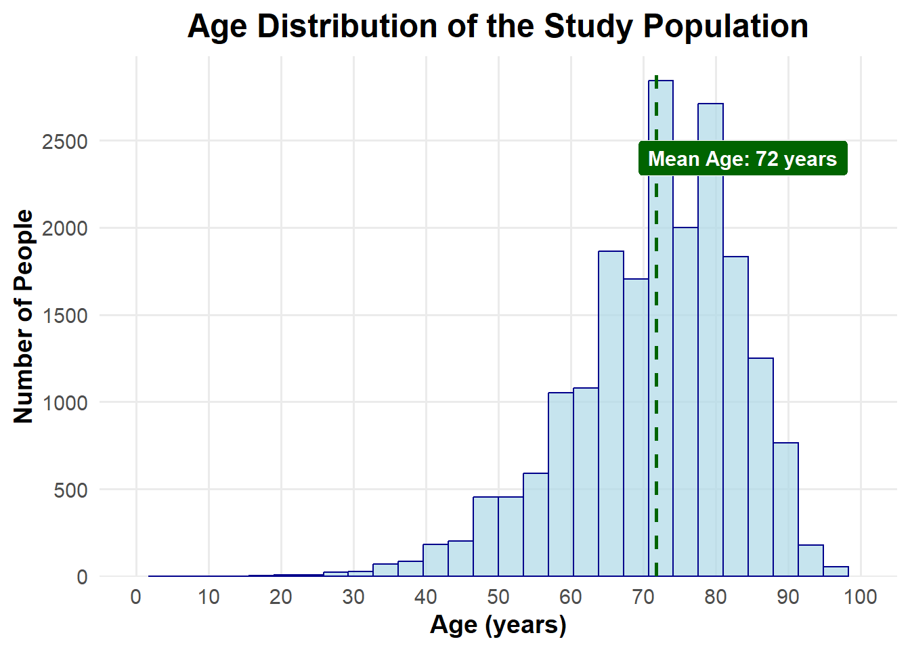
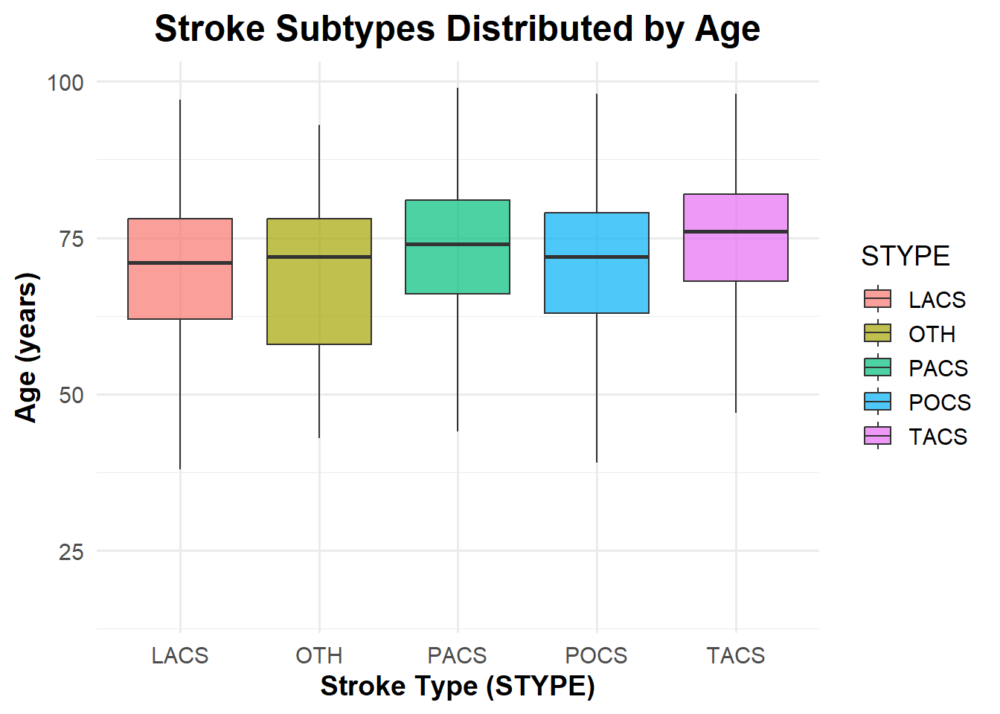
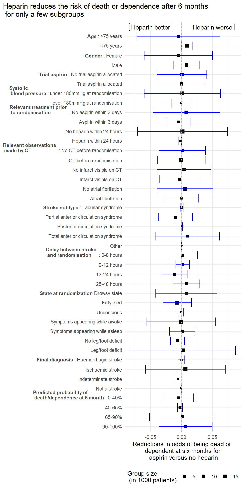
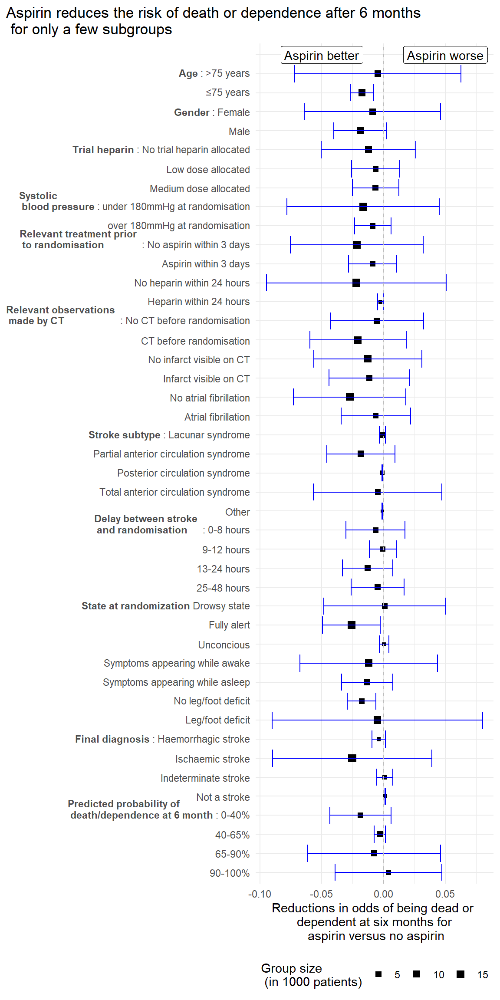
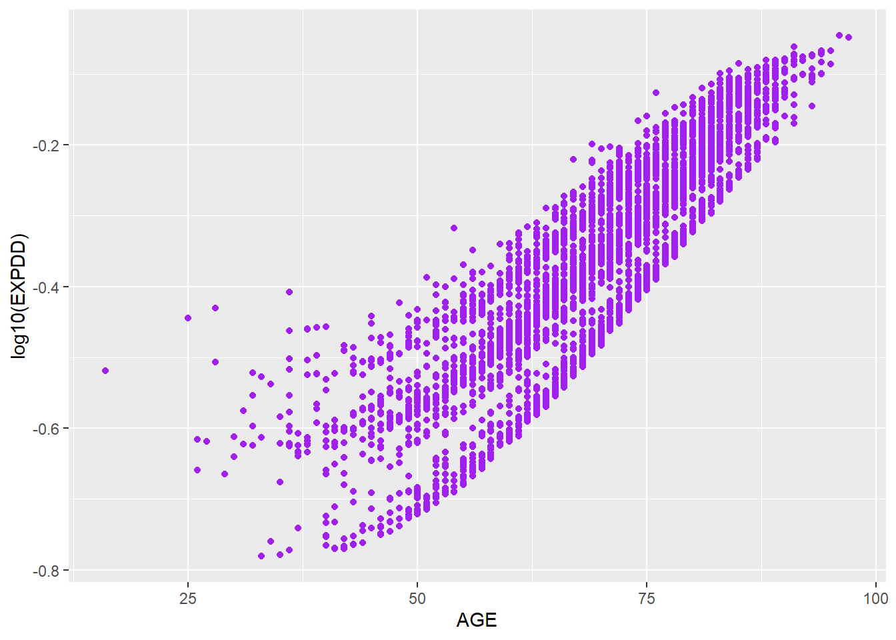
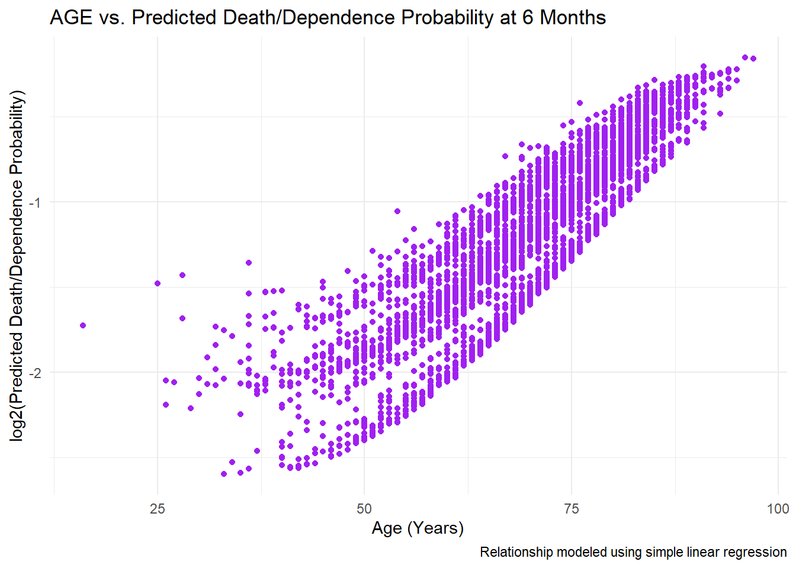
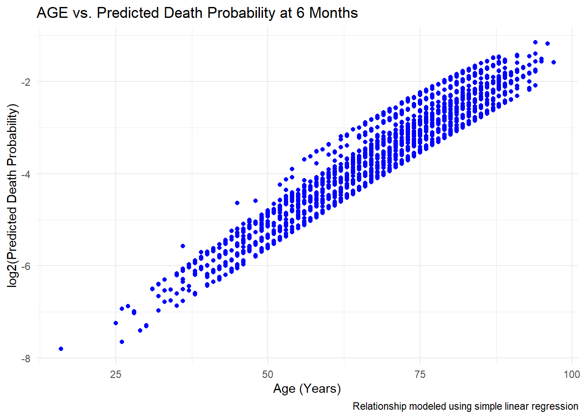
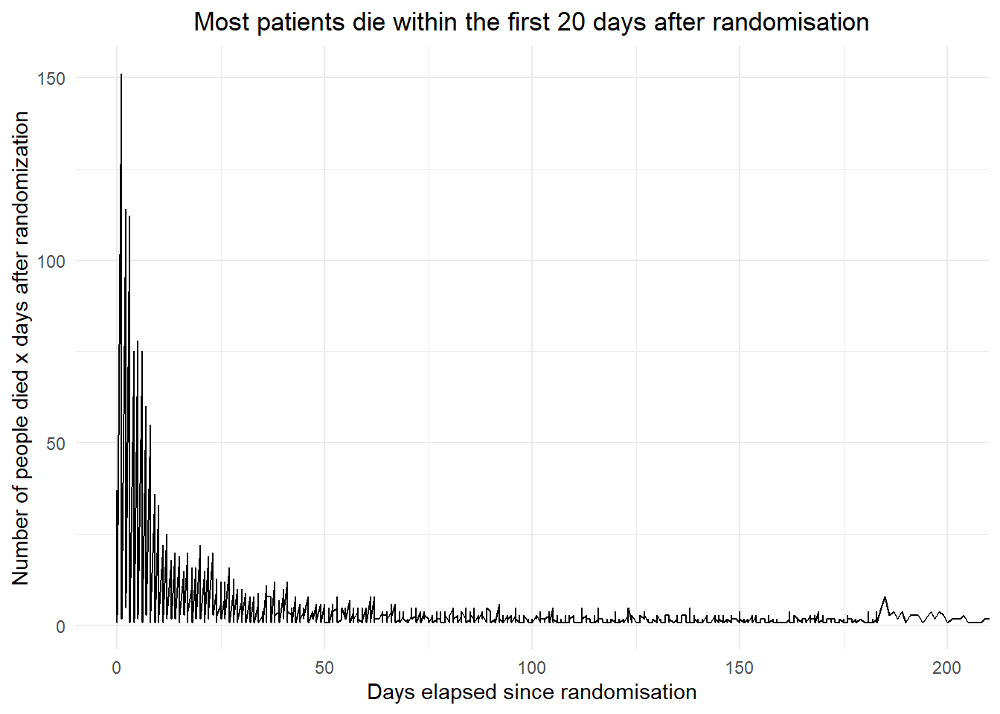
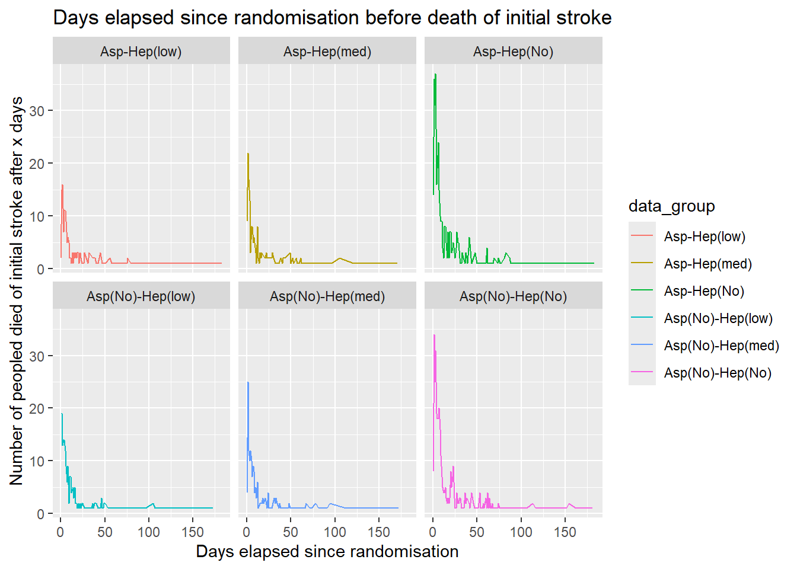
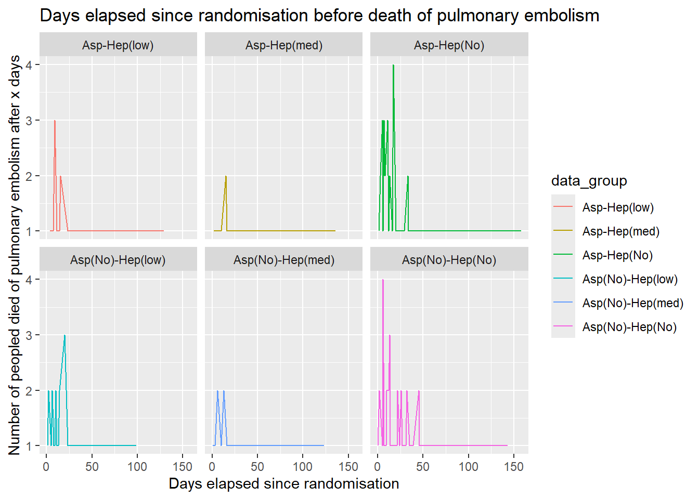

# Individual HTMLs


::: {.cell}

```{.r .cell-code}
library("here")
```
:::

::: {.cell}

```{.r .cell-code}
quarto::quarto_render(here("R/01_load.qmd"))
```

::: {.cell-output .cell-output-stdout}

```


processing file: 01_load.qmd

  |                                                          
  |                                                    |   0%
  |                                                          
  |.......                                             |  14%                  
  |                                                          
  |...............                                     |  29% [unnamed-chunk-1]
  |                                                          
  |......................                              |  43%                  
  |                                                          
  |..............................                      |  57% [unnamed-chunk-2]
  |                                                          
  |.....................................               |  71%                  
  |                                                          
  |.............................................       |  86% [unnamed-chunk-3]
  |                                                          
  |....................................................| 100%                  
                                                                                                            
output file: 01_load.knit.md

pandoc 
  to: html
  output-file: 01_load.html
  standalone: true
  section-divs: true
  html-math-method: mathjax
  wrap: none
  default-image-extension: png
  
metadata
  document-css: false
  link-citations: true
  date-format: long
  lang: en
  title: 01_load
  author: 'Group 29: Helena Møller, Emma Christensen, Frederik Holmstrup, Casper Harreby & Laura Christiansen'
  
Output created: 01_load.html
```


:::
:::

---
title: "01_load"
author: "Group 29: Helena Møller, Emma Christensen, Frederik Holmstrup, Casper Harreby & Laura Christiansen"
format: html
---


## Introduction

The data used for this project is the data used for the article "The International Stroke Trial (IST): a randomised trial of aspirin, subcutaneous heparin, both, or neither among 19435 patient with acute ischaemic stroke" by the International Stroke Trial Collaborative Group. The purpose of this project is to improve some of the figures from the article as well as trying to get further insights. The purpose of the study and our project is to access the efficacy and safety of antithrombic therapy for treatment of acute ischemic strokes. Two different doses of heparin is tested together with and without a dose of aspirin. That creates 6 groups of patients, where one of them is the control group with no treatment.

## Loading relevant libraries


::: {.cell}

```{.r .cell-code}
library("tidyverse")
library("here")
```
:::


## Loading relevant data

The data webpage link are used for a direct load of the data to ensure reproducability


::: {.cell}

```{.r .cell-code}
#The data is loaded directly from the webpage
raw_data <- read_csv(file = "https://datashare.ed.ac.uk/bitstream/handle/10283/124/IST_corrected.csv?sequence=5&isAllowed=y")
```
:::


## Saving data in a tsv format

The data is saved in a data/\_raw folder on your local directory. The .gitignore is modified to include the entire data folder.


::: {.cell}

```{.r .cell-code}
# Define the file path using the here terminology
file_path <- here("data/_raw/")

#Checking if the folder path already exists in your local directory
if (!file.exists(file_path)){dir.create(file_path, recursive = TRUE)}

#Write the data to a TSV file
write_tsv(x = raw_data, 
          file = str_c(file_path, "01_dat_load.tsv"))
```
:::

::: {.cell}

```{.r .cell-code}
file.rename(here("R/01_load.html"),here("results/01_load.html"))
```

::: {.cell-output .cell-output-stdout}

```
[1] TRUE
```


:::
:::

::: {.cell}

```{.r .cell-code}
quarto::quarto_render(here("R/02_clean.qmd"))
```

::: {.cell-output .cell-output-stdout}

```


processing file: 02_clean.qmd

  |                                                         
  |                                                   |   0%
  |                                                         
  |.                                                  |   2%                   
  |                                                         
  |..                                                 |   5% [unnamed-chunk-1] 
  |                                                         
  |....                                               |   7%                   
  |                                                         
  |.....                                              |   9% [unnamed-chunk-2] 
  |                                                         
  |......                                             |  12%                   
  |                                                         
  |.......                                            |  14% [unnamed-chunk-3] 
  |                                                         
  |........                                           |  16%                   
  |                                                         
  |.........                                          |  19% [unnamed-chunk-4] 
  |                                                         
  |...........                                        |  21%                   
  |                                                         
  |............                                       |  23% [unnamed-chunk-5] 
  |                                                         
  |.............                                      |  26%                   
  |                                                         
  |..............                                     |  28% [unnamed-chunk-6] 
  |                                                         
  |...............                                    |  30%                   
  |                                                         
  |.................                                  |  33% [unnamed-chunk-7] 
  |                                                         
  |..................                                 |  35%                   
  |                                                         
  |...................                                |  37% [unnamed-chunk-8] 
  |                                                         
  |....................                               |  40%                   
  |                                                         
  |.....................                              |  42% [unnamed-chunk-9] 
  |                                                         
  |.......................                            |  44%                   
  |                                                         
  |........................                           |  47% [unnamed-chunk-10]
  |                                                         
  |.........................                          |  49%                   
  |                                                         
  |..........................                         |  51% [unnamed-chunk-11]
  |                                                         
  |...........................                        |  53%                   
  |                                                         
  |............................                       |  56% [unnamed-chunk-12]
  |                                                         
  |..............................                     |  58%                   
  |                                                         
  |...............................                    |  60% [unnamed-chunk-13]
  |                                                         
  |................................                   |  63%                   
  |                                                         
  |.................................                  |  65% [unnamed-chunk-14]
  |                                                         
  |..................................                 |  67%                   
  |                                                         
  |....................................               |  70% [unnamed-chunk-15]
  |                                                         
  |.....................................              |  72%                   
  |                                                         
  |......................................             |  74% [unnamed-chunk-16]
  |                                                         
  |.......................................            |  77%                   
  |                                                         
  |........................................           |  79% [unnamed-chunk-17]
  |                                                         
  |..........................................         |  81%                   
  |                                                         
  |...........................................        |  84% [unnamed-chunk-18]
  |                                                         
  |............................................       |  86%                   
  |                                                         
  |.............................................      |  88% [unnamed-chunk-19]
  |                                                         
  |..............................................     |  91%                   
  |                                                         
  |...............................................    |  93% [unnamed-chunk-20]
  |                                                         
  |.................................................  |  95%                   
  |                                                         
  |.................................................. |  98% [unnamed-chunk-21]
  |                                                         
  |...................................................| 100%                   
                                                                                                             
output file: 02_clean.knit.md

pandoc 
  to: html
  output-file: 02_clean.html
  standalone: true
  section-divs: true
  html-math-method: mathjax
  wrap: none
  default-image-extension: png
  
metadata
  document-css: false
  link-citations: true
  date-format: long
  lang: en
  title: 02_clean
  author: 'Group 29: Helena Møller, Emma Christensen, Frederik Holmstrup, Casper Harreby & Laura Christiansen'
  
Output created: 02_clean.html
```


:::
:::

---
title: "02_clean"
author: "Group 29: Helena Møller, Emma Christensen, Frederik Holmstrup, Casper Harreby & Laura Christiansen"
format: html
execute: 
  message: FALSE
  warning: FALSE
---


# Data Cleaning

## Loading libraries


::: {.cell}

```{.r .cell-code}
library("tidyverse")
library("knitr")
library("quarto")
library("here")
```
:::


## Loading data


::: {.cell}

```{.r .cell-code}
data <- read_tsv(here("data/_raw/01_dat_load.tsv"))
```
:::


## Data cleaning

### Ensuring global use of Yes/No for binary variables, and NA if information is unknown (U/u/0)

During revision of the data, many faulty characters of "U" and "C" appear within columns, only meant for "Y" or "N". The "U" and "C" are therefore changed to NA to indicate a missing value.


::: {.cell}

```{.r .cell-code}
#converting U and C to NA
data_clean_properNA <- data |> 
  #Replacing all C with NA to indicate missing value
  mutate(across(where(is.character), ~ na_if(.,"C"))) |> 
  #Replace all U and u with NA in all columns except for RCONSC, where U = unconscious
  mutate(RCONSC = if_else(RCONSC == "U", "unconscious", RCONSC)) |> 
  mutate(across(where(is.character), ~na_if(.,"U")),
         across(where(is.character), ~na_if(.,"u"))) |> 
  mutate(RCONSC = if_else(RCONSC == "unconscious", "U", RCONSC))
```
:::


In the variable SET14D, a 0 is indicating that it is not known if the subject is alive or dead at the 14 day checkup. We therefore want to change the 0 to NA, indicating that this information is not known.


::: {.cell}

```{.r .cell-code}
#converting 0 to NA
data_clean_properNA2 <- data_clean_properNA |> 
  mutate(SET14D = if_else(SET14D == 0, NA, SET14D))
```
:::


In column DASP14 and FAP, both "n" and "N" along with "y" and "Y" both indicating "No" and "Yes" respectively. To match the general syntax, all letters are made upper case.


::: {.cell}

```{.r .cell-code}
#making y and n upper case
data_clean_propervar <- data_clean_properNA2 |> 
  mutate(across(c(DASP14,FAP), ~str_to_upper(.)))
```
:::


In the columns DVT14, H14, DDEAD, HTI14, ID14, ISC14, NCB14, NK14, PE14, TRAN14, values are 0 = no and 1 = yes, and to match the other binary variables they will therefore be transformed to N = no and Y = yes.


::: {.cell}

```{.r .cell-code}
#converting 0 to N(no) and 1 to Y(yes)
data_clean_propervar2 <- data_clean_propervar |> 
  mutate(across(c(DVT14,H14,DDEAD,HTI14,ID14,ISC14,NCB14,NK14,PE14,TRAN14,STRK14), 
                ~case_when(
                  . == 0 ~ "N",
                  . == 1 ~ "Y")))
```
:::


### Ensuring global syntax for numbers 1-8 naming cause of death

The numbers 1-8 is used for naming cause of death. Therefore OCCODE is renamed to the actual meanings of the numbers 0-9 to prevent confusion to number code in cause of death.


::: {.cell}

```{.r .cell-code}
#changing values 0-9 for occode to their actual meaning
data_clean_properOCcode <- data_clean_propervar2 |> 
  mutate(OCCODE = case_when(
    OCCODE %in% c(0,8,9) ~ NA,
    OCCODE == 1 ~ "dead",
    OCCODE == 2 ~ "dependent",
    OCCODE == 3 ~ "not recovered",
    OCCODE == 4 ~ "recovered"))
```
:::


### Converting all time-values exceeding 59 min and 23 hours to NA

In the two columns minlocal and hourlocal the local time of the randomization study initiation is annotated. This value is not allowed to be higher than 59 min and 23 hours. All values above this is set to NA for missing values.


::: {.cell}

```{.r .cell-code}
#replacing all values above 59 in minute and 23 hour with NA
data_clean_truetime <- data_clean_properOCcode |> 
  mutate(MINLOCAL = if_else(MINLOCAL > 59, NA, MINLOCAL),
         HOURLOCAL = if_else(HOURLOCAL > 23, NA, HOURLOCAL))
```
:::


### Fixing errors made during data collection

For the pilot study, medium dose of heparin is annotated as high dose. The high dose annotation is changed to medium dose annotation, and the two columns for medium dose of pilot study and following study is merged.


::: {.cell}

```{.r .cell-code}
#replacing all H for M for indicating medium dose (Heparin)
data_clean_noH <- data_clean_truetime |> 
  mutate(RXHEP = if_else(RXHEP == "H","M",RXHEP))

#merging the Hep high and hep medium column, changing unknown to NA
data_clean_correctHepDose <- data_clean_noH |> 
  mutate(across(c(DMH14,DHH14), ~replace_na(.,""))) |> 
  unite(DMH14, c(DMH14,DHH14), sep = "") |> 
  mutate(DMH14 = na_if(DMH14,"")) |> 
  mutate(across(c(DMH14,DLH14), ~na_if(., "U")))
```
:::


The variable STRK14 is annotated as STR14 in the data description, and the column is therefore renamed accordingly


::: {.cell}

```{.r .cell-code}
#converting name of variable STRK14 to align with the variable description
data_clean_annotationalign <- data_clean_correctHepDose |> 
  rename("STR14" = STRK14)
```
:::


In the RDATE variable, all times are annotated as polish months and year. We aim to convert this information in two columns, and reencode the polish to english months


::: {.cell}

```{.r .cell-code}
#converting polish month names to english month names
data_clean_english <- data_clean_annotationalign |> 
  separate_wider_delim(RDATE,delim = "-", names = c("RMONTH","RYEAR")) |> 
  mutate(RMONTH = case_when(
    RMONTH == "sty" ~ "Jan",
    RMONTH == "lut" ~ "Feb",
    RMONTH == "mar" ~ "Mar",
    RMONTH == "kwi" ~ "Apr",
    RMONTH == "maj" ~ "May",
    RMONTH == "cze" ~ "Jun",
    RMONTH == "lip" ~ "Jul",
    RMONTH == "sie" ~ "Aug",
    RMONTH == "wrz" ~ "Sep",
    RMONTH == "pa\x9f" ~ "Oct",
    RMONTH == "lis" ~ "Nov",
    RMONTH == "gru" ~ "Dec"))
```
:::


### Removal of irrelevant columns

Some columns is already known to not be relevant. These will therefore be removed to reduce the space of the column.


::: {.cell}

```{.r .cell-code}
#removing of irrelevant columns
data_clean_removecol <- data_clean_english |> 
  #Removing comment columns
  select(-c(DMAJNCHX,DNOSTRKX,DSIDEX,DDEADX,FDEADX)) |> 
  #Removing columns which are not interesting for our studies
  select(-c(HOSPNUM,CNTRYNUM,SET14D,NCCODE)) |> 
  #Removing column which have unknown meaning as not included in variable descriptions
  select(-c(DIED))
```
:::


### Merging of columns

The columns DDEADD and FDEADD are the same, as the value is the date of death of the subject, which is independent of when the checkup is done. The columns are therefore renamed to DEADD (deathdate) and one of the columns are removed.


::: {.cell}

```{.r .cell-code}
#removing ambigious columns
data_clean_mergecol <-  data_clean_removecol |> 
  rename("DEADD" = DDEADD) |> 
  select(-FDEADD)
```
:::


There are four different columns in the data which all represents the final diagnosis of the initial event. It is fair to assume that if one final diagnosis is made of an initial event then another diagnosis is not made, as there are no data entries which has "Y" in more than one of the diagnosis. One column, DDIAG, is therefore made to represent the final diagnosis of the initial event.


::: {.cell}

```{.r .cell-code}
#mergin 4 columns into a new (DDIAG)
data_clean_mergecol2 <- data_clean_mergecol |> 
  mutate("DDIAG" = case_when(
    DDIAGISC == "Y" ~ "DDIAGISC",
    DDIAGHA == "Y" ~ "DDIAGHA",
    DDIAGUN == "Y" ~ "DDIAGUN",
    DNOSTRK == "Y" ~ "DNOSTRK",
    TRUE ~ NA))
```
:::


The causes of death at 6 months are split into 8 different columns called DEAD1-8. To have more tidy data, all columns are merged together into one column, using the same 1-8 code for cause of death as DDEADC and FDEADC columns. The new column is called DEADC (death cause)


::: {.cell}

```{.r .cell-code}
#creating of one column DEADC, which contains all causes of death as 1-8
data_clean_properDEADcode <- data_clean_mergecol2 |> 
  mutate(DEAD1 = if_else(DEAD1 == 1, "1", ""),
         DEAD2 = if_else(DEAD2 == 1, "2", ""),
         DEAD3 = if_else(DEAD3 == 1, "3", ""),
         DEAD4 = if_else(DEAD4 == 1, "4", ""),
         DEAD5 = if_else(DEAD5 == 1, "5", ""),
         DEAD6 = if_else(DEAD6 == 1, "6", ""),
         DEAD7 = if_else(DEAD7 == 1, "7", ""),
         DEAD8 = if_else(DEAD8 == 1, "8", "")) |>
  unite(DEADC, c(DEAD1,DEAD2,DEAD3,DEAD4,DEAD5,DEAD6,DEAD7,DEAD8), sep = "") |> 
  mutate(DEADC = na_if(DEADC,""))
```
:::


### Splitting/joining data

Adding unique identifier (number) to each patient is done for the purpose of having a key to join the data after splitting. Creating a variable is normally thought of as data augmentation, but it is done in the cleaning for this purpose.

In order to be able to distinguish patients participating in the trial a Unique Subject Identifier USUBJID is added a variable number one in the cleaned dataset.


::: {.cell}

```{.r .cell-code}
#adding a unique identifier (number) to each patient
data_clean_numbered<- data_clean_properDEADcode |> 
  mutate(USUBJID = row_number()) |> 
  select(USUBJID, everything())
```
:::


It might be relevant to split data into multiple datasets. This is the case if we want to share some data with stakeholders while some variables contain information that is sensitive and need to remove from the dataset (e.g. GDPR reasons).


::: {.cell}

```{.r .cell-code}
#splitting of dataset into 2
data_split_1 <- data_clean_numbered |> 
  select(1:50)

data_split_2 <- data_clean_numbered |> 
  select(1, 51:96)
```
:::

::: {.cell}

```{.r .cell-code}
#joining dataset by the key which we have created
data_inner_joined <- data_split_1 |> 
  inner_join(data_split_2, by = join_by(USUBJID))
```
:::


Another scenario might be that while the external stakeholder is working with their part of the dataset `data_split_2`, patients might have withdrawn from the study and rows have been removed in `data_split_1`. If we want to remove the same patients/observations during the join, `left_join()` will be used.


::: {.cell}

```{.r .cell-code}
#removing observations
data_split_1_1 <- data_split_1 |>
  slice(-sample(n(), 500))
```
:::

::: {.cell}

```{.r .cell-code}
#combining two datasets, where one has missing observations
data_left_joined <- data_split_1_1 |> 
  left_join(data_split_2, by = join_by(USUBJID))
```
:::


## Saving final clean data


::: {.cell}

```{.r .cell-code}
write_tsv(data_inner_joined, file = here("data/02_dat_clean.tsv"))
```
:::

::: {.cell}

```{.r .cell-code}
file.rename(here("R/02_clean.html"),here("results/02_clean.html"))
```

::: {.cell-output .cell-output-stdout}

```
[1] TRUE
```


:::
:::

::: {.cell}

```{.r .cell-code}
quarto::quarto_render(here("R/03_augment.qmd"))
```

::: {.cell-output .cell-output-stdout}

```


processing file: 03_augment.qmd

  |                                                          
  |                                                    |   0%
  |                                                          
  |.....                                               |   9%                  
  |                                                          
  |.........                                           |  18% [unnamed-chunk-1]
  |                                                          
  |..............                                      |  27%                  
  |                                                          
  |...................                                 |  36% [unnamed-chunk-2]
  |                                                          
  |........................                            |  45%                  
  |                                                          
  |............................                        |  55% [unnamed-chunk-3]
  |                                                          
  |.................................                   |  64%                  
  |                                                          
  |......................................              |  73% [unnamed-chunk-4]
  |                                                          
  |...........................................         |  82%                  
  |                                                          
  |...............................................     |  91% [unnamed-chunk-5]
  |                                                          
  |....................................................| 100%                  
                                                                                                            
output file: 03_augment.knit.md

pandoc 
  to: html
  output-file: 03_augment.html
  standalone: true
  section-divs: true
  html-math-method: mathjax
  wrap: none
  default-image-extension: png
  
metadata
  document-css: false
  link-citations: true
  date-format: long
  lang: en
  title: 03_augment
  author: 'Group 29: Helena Møller, Emma Christensen, Frederik Holmstrup, Casper Harreby & Laura Christiansen'
  
Output created: 03_augment.html
```


:::
:::

---
title: "03_augment"
author: "Group 29: Helena Møller, Emma Christensen, Frederik Holmstrup, Casper Harreby & Laura Christiansen"
format: html
execute: 
  message: FALSE
  warning: FALSE
---


# Data Augmentation

## Loading libraries


::: {.cell}

```{.r .cell-code}
library("tidyverse")
library("here")
```
:::


## Loading clean data


::: {.cell}

```{.r .cell-code}
data_clean <- read_tsv(here("data/02_dat_clean.tsv"))
```
:::


## Data augmentation

DLH14 describes if the subject had a low dose of heparin (Yes/No), DMH14 describes if the subject had a medium dose of heparin (Yes/No), given for 14 days or till death/discharge. We want to merge the two columns into one to improve tidyness, Introduce L for low, M for medium, C for control (no Heparin) and NA for no known information or conflicting information in the two columns.


::: {.cell}

```{.r .cell-code}
#creating groups for heparin doses
data_clean_hepgroups <- data_clean |> 
  mutate("DH14" = case_when(
    (is.na(DLH14) & is.na(DMH14)) ~ NA,
    (DLH14 == "Y" & DMH14 == "Y") ~ NA,
    (DLH14 == "N" & DMH14 == "N") ~ "C",
    (DLH14 == "Y" & DMH14 == "N") ~ "L",
    (DLH14 == "N" & DMH14 == "Y") ~ "M"))
```
:::


There are 6 different groups in the data. We therefore want to make a group name column to get an easy overview of the groups in the data


::: {.cell}

```{.r .cell-code}
#creating groups based on treatment
data_clean_trtgroups <- data_clean_hepgroups |> 
  mutate("data_group" = case_when(
    (RXASP == "Y" & RXHEP == "L") ~ "Asp-Hep(low)",
    (RXASP == "Y" & RXHEP == "M") ~ "Asp-Hep(med)",
    (RXASP == "Y" & RXHEP == "N") ~ "Asp-Hep(No)",
    (RXASP == "N" & RXHEP == "L") ~ "Asp(No)-Hep(low)",
    (RXASP == "N" & RXHEP == "M") ~ "Asp(No)-Hep(med)",
    (RXASP == "N" & RXHEP == "N") ~ "Asp(No)-Hep(No)"
  ))
```
:::


## Saving augmented data


::: {.cell}

```{.r .cell-code}
write_tsv(data_clean_trtgroups, file = here("data/03_dat_aug.tsv"))
```
:::


## 


::: {.cell}

```{.r .cell-code}
file.rename(here("R/03_augment.html"),here("results/03_augment.html"))
```

::: {.cell-output .cell-output-stdout}

```
[1] TRUE
```


:::
:::

::: {.cell}

```{.r .cell-code}
quarto::quarto_render(here("R/04_describe.qmd"))
```

::: {.cell-output .cell-output-stdout}

```


processing file: 04_describe.qmd

  |                                                          
  |                                                    |   0%
  |                                                          
  |...                                                 |   5%                  
  |                                                          
  |.....                                               |  11% [unnamed-chunk-1]
  |                                                          
  |........                                            |  16%                  
  |                                                          
  |...........                                         |  21% [unnamed-chunk-2]
  |                                                          
  |..............                                      |  26%                  
  |                                                          
  |................                                    |  32% [unnamed-chunk-3]
  |                                                          
  |...................                                 |  37%                  
  |                                                          
  |......................                              |  42% [unnamed-chunk-4]
  |                                                          
  |.........................                           |  47%                  
  |                                                          
  |...........................                         |  53% [unnamed-chunk-5]
  |                                                          
  |..............................                      |  58%                  
  |                                                          
  |.................................                   |  63% [unnamed-chunk-6]
  |                                                          
  |....................................                |  68%                  
  |                                                          
  |......................................              |  74% [unnamed-chunk-7]
  |                                                          
  |.........................................           |  79%                  
  |                                                          
  |............................................        |  84% [unnamed-chunk-8]
  |                                                          
  |...............................................     |  89%                  
  |                                                          
  |.................................................   |  95% [unnamed-chunk-9]
  |                                                          
  |....................................................| 100%                  
                                                                                                            
output file: 04_describe.knit.md

pandoc 
  to: html
  output-file: 04_describe.html
  standalone: true
  section-divs: true
  html-math-method: mathjax
  wrap: none
  default-image-extension: png
  
metadata
  document-css: false
  link-citations: true
  date-format: long
  lang: en
  title: 04_describe
  author: 'Group 29: Helena Møller, Emma Christensen, Frederik Holmstrup, Casper Harreby & Laura Christiansen'
  
Output created: 04_describe.html
```


:::
:::

---
title: "04_describe"
author: "Group 29: Helena Møller, Emma Christensen, Frederik Holmstrup, Casper Harreby & Laura Christiansen"
format: html
execute: 
  message: FALSE
  warning: FALSE
---


# Descriptive analysis

## Loading Libraries


::: {.cell}

```{.r .cell-code}
library("tidyverse") 
library("ggplot2") 
library("dplyr") 
library("readr") 
library("here")
```
:::


## Loading data


::: {.cell}

```{.r .cell-code}
data <- read_tsv(here("data/03_dat_aug.tsv"))
```
:::


## Age distribution of study population

This section explores the age distribution of the study population:


::: {.cell}

```{.r .cell-code}
# Calculate the mean age
mean_age <- mean(data$AGE, na.rm = TRUE)

# Excluding missing or negative ages
data <- data |> 
  filter(!is.na(AGE) & AGE >= 0)

# Visualizing the age distribution
p1 <- ggplot(data, aes(x = AGE)) +      
  geom_histogram(fill = "lightblue", 
                 color = "darkblue", 
                 bins = 30, 
                 alpha = 0.7) + 
  labs(
    title = "Age Distribution of the Study Population",             
    x = "Age (years)", 
    y = "Number of People"
  ) +      
  theme_minimal(base_size = 14) +      
  theme(
    plot.title = element_text(hjust = 0.5, face = "bold", size = 18), 
    axis.title.x = element_text(face = "bold", size = 14),            
    axis.title.y = element_text(face = "bold", size = 14),         
    panel.grid.minor = element_blank()
  ) +                
  scale_x_continuous(breaks = seq(0, 100, by = 10), 
                     limits = c(0, 100)) +     
  scale_y_continuous(expand = expansion(mult = c(0, 0.05)), 
                     breaks = seq(0, 3000, by = 500)) +    
  geom_segment(
    x = mean_age, xend = mean_age, y = 0, yend = 2900, 
    color = "darkgreen", linetype = "dashed", size = 1.0
  ) +      
  annotate(
    "label", 
    x = mean_age + 12, y = 2400, 
    label = paste("Mean Age:", round(mean_age, 0), "years"),                 
    color = "white", fill = "darkgreen", 
    fontface = "bold", size = 4,                      
    label.padding = unit(0.4, "lines")  
    # Mean age shown in a text box with padding 
  )

# Display the plot
print(p1)
```

::: {.cell-output-display}
{width=672}
:::
:::


From the histogram distributed by age, it can be seen that the mean age of the study population is 72 years.

## Age distribution of stroke subtypes (STYPE)

The stroke subtypes (STYPE) are here distributed by age and visualized with boxplots. Here's a brief description of the different subtypes:

-   **LACS (Lacunar Stroke Syndrome)**

    Blockage of small penetrating arteries in deep brain structures, such as the basal ganglia, thalamus, or internal capsule. The prognosis is genereally better than other subtypes; smaller infarct size, where infarct size refers to the portion of the brain that has suffered irreversible damage from a stroke due to insufficient oxygen and nutrients.

-   **PACS (Partial Anterior Circulation Syndrome)**

    Partial occlusion in the anterior cerebral circulation, typically affecting the middle cerebral artery (MCA) or anterior cerebral artery (ACA). The prognosis is moderate; larger infarct than LACS, but less severe than e.g TACS.

-   **POCS (Posterior Circulation Syndrome)**

    Infarction in the posterior cerebral circulation, affecting the brainstem, cerebellum, or occipital lobes. The prognosis is variable, depending on location and size of the infarction.

-   **TACS (Total Anterior Circulation Syndrome)**

    Complete occlusion of the anterior cerebral circulation, typically affecting the middle cerebral artery (MCA) or internal carotid artery (ICA). The prognosis is poor; associated with large infarcts, severe disability, and high mortality rates.

-   **OTH** refers to other types of strokes.


::: {.cell}

```{.r .cell-code}
p2 <- data |> 
  ggplot(aes(x = STYPE, y = AGE, fill = STYPE)) + 
  geom_boxplot(alpha = 0.7, outlier.shape = NA) + # Boxplot without outlier points
  labs(
    title = "Stroke Subtypes Distributed by Age",
    x = "Stroke Type (STYPE)",
    y = "Age (years)"
  ) + 
  theme_minimal(base_size = 14) + 
  theme(
    plot.title = element_text(hjust = 0.5, face = "bold", size = 18),
    axis.title.x = element_text(face = "bold", size = 14),
    axis.title.y = element_text(face = "bold", size = 14),
    legend.position = "right"
  )

# Display the plot
print(p2)
```

::: {.cell-output-display}
{width=672}
:::
:::

::: {.cell}

```{.r .cell-code}
STYPE_median <- data |>
  group_by(STYPE) |>
  summarize(Median_AGE = round(median(AGE, na.rm = TRUE), 0))

print(STYPE_median)
```

::: {.cell-output .cell-output-stdout}

```
# A tibble: 5 × 2
  STYPE Median_AGE
  <chr>      <dbl>
1 LACS          71
2 OTH           72
3 PACS          74
4 POCS          72
5 TACS          76
```


:::
:::


The median age of the different stroke subtypes are shown, where the most severe subtype TACS with high mortality rates, has the highest median age of 76 years.

# Data visualization

The study population has been divided into six data groups based on the dose of heparin (no, low, medium) and whether aspirin was located. Below is a summary of the number of patients in each test group:


::: {.cell}

```{.r .cell-code}
# Summarize and count patients by data group
data_summary <- data |> 
  group_by(data_group) |> 
  count(name = "patient_count") 

print(data_summary)
```

::: {.cell-output .cell-output-stdout}

```
# A tibble: 6 × 2
# Groups:   data_group [6]
  data_group       patient_count
  <chr>                    <int>
1 Asp(No)-Hep(No)           4860
2 Asp(No)-Hep(low)          2429
3 Asp(No)-Hep(med)          2426
4 Asp-Hep(No)               4858
5 Asp-Hep(low)              2432
6 Asp-Hep(med)              2430
```


:::
:::


## Predicted probability of death by gender at 6 months

This section visualizes the predicted probability of death at six months (EXPD6) by gender. A boxplot is used to compare probabilities.


::: {.cell}

```{.r .cell-code}
# Create boxplot for predicted probability of death by gender
p3 <- data |> 
  ggplot(aes(x = SEX, y = EXPD6, fill = SEX)) +   
  geom_boxplot(alpha = 0.7, color = "black") +    
  scale_fill_manual(values = c("darkred", "blue")) + 
  labs(
    title = "Predicted Probability of Death at 6 Months",     
    x = "Gender",     
    y = "Predicted Probability (EXPD6)",     
    fill = "Gender"
  ) + 
  theme_minimal(base_size = 14) +   
  theme(
    plot.title = element_text(hjust = 0.5, face = "bold", size = 15),
    axis.title.x = element_text(face = "bold", size = 10), 
    axis.title.y = element_text(face = "bold", size = 10), 
    legend.position = "top"
  ) +   
  scale_y_continuous(
    limits = c(0, 1),     
    expand = expansion(mult = c(0.05, 0.1))
  )

# Display the plot
print(p3)
```

::: {.cell-output-display}
{width=672}
:::
:::


## Comparison of median of EXPD6 by gender

The following table summarizes the median predicted probability of death (EXPD6) by gender.


::: {.cell}

```{.r .cell-code}
#Show median EXPD6 by gender  

median_table <- data |>
  group_by(SEX) |>
  summarize(Median_EXPD6 = median(EXPD6, na.rm = TRUE)) 

print(median_table)
```

::: {.cell-output .cell-output-stdout}

```
# A tibble: 2 × 2
  SEX   Median_EXPD6
  <chr>        <dbl>
1 F            0.189
2 M            0.139
```


:::
:::


From the table, females have a higher median probability of death at 6 months (0.1888) compared to males (0.1390).

## Save the results


::: {.cell}

```{.r .cell-code}
# Save the plots as PNG files

ggsave(here("results/04_description_plot_1.png"), plot = p1, width = 8, height = 4, dpi = 300, bg = "white")

ggsave(here("results/04_description_plot_2.png"), plot = p2, width = 8, height = 4, dpi = 300, bg = "white")

ggsave(here("results/04_description_plot_3.png"), plot = p3, width = 8, height = 4, dpi = 300, bg = "white")
```
:::

::: {.cell}

```{.r .cell-code}
file.rename(here("R/04_describe.html"),here("results/04_describe.html"))
```

::: {.cell-output .cell-output-stdout}

```
[1] TRUE
```


:::
:::

::: {.cell}

```{.r .cell-code}
quarto::quarto_render(here("R/05_analysis_1.qmd"))
```

::: {.cell-output .cell-output-stdout}

```


processing file: 05_analysis_1.qmd

  |                                                         
  |                                                   |   0%
  |                                                         
  |.                                                  |   3%                   
  |                                                         
  |...                                                |   5% [unnamed-chunk-1] 
  |                                                         
  |....                                               |   8%                   
  |                                                         
  |......                                             |  11% [unnamed-chunk-2] 
  |                                                         
  |.......                                            |  14%                   
  |                                                         
  |........                                           |  16% [unnamed-chunk-3] 
  |                                                         
  |..........                                         |  19%                   
  |                                                         
  |...........                                        |  22% [unnamed-chunk-4] 
  |                                                         
  |............                                       |  24%                   
  |                                                         
  |..............                                     |  27% [unnamed-chunk-5] 
  |                                                         
  |...............                                    |  30%                   
  |                                                         
  |.................                                  |  32% [unnamed-chunk-6] 
  |                                                         
  |..................                                 |  35%                   
  |                                                         
  |...................                                |  38% [unnamed-chunk-7] 
  |                                                         
  |.....................                              |  41%                   
  |                                                         
  |......................                             |  43% [unnamed-chunk-8] 
  |                                                         
  |.......................                            |  46%                   
  |                                                         
  |.........................                          |  49% [unnamed-chunk-9] 
  |                                                         
  |..........................                         |  51%                   
  |                                                         
  |............................                       |  54% [unnamed-chunk-10]
  |                                                         
  |.............................                      |  57%                   
  |                                                         
  |..............................                     |  59% [unnamed-chunk-11]
  |                                                         
  |................................                   |  62%                   
  |                                                         
  |.................................                  |  65% [unnamed-chunk-12]
  |                                                         
  |..................................                 |  68%                   
  |                                                         
  |....................................               |  70% [unnamed-chunk-13]
  |                                                         
  |.....................................              |  73%                   
  |                                                         
  |.......................................            |  76% [unnamed-chunk-14]
  |                                                         
  |........................................           |  78%                   
  |                                                         
  |.........................................          |  81% [unnamed-chunk-15]
  |                                                         
  |...........................................        |  84%                   
  |                                                         
  |............................................       |  86% [unnamed-chunk-16]
  |                                                         
  |.............................................      |  89%                   
  |                                                         
  |...............................................    |  92% [unnamed-chunk-17]
  |                                                         
  |................................................   |  95%                   
  |                                                         
  |.................................................. |  97% [unnamed-chunk-18]
  |                                                         
  |...................................................| 100%                   
                                                                                                             
output file: 05_analysis_1.knit.md

pandoc 
  to: html
  output-file: 05_analysis_1.html
  standalone: true
  section-divs: true
  html-math-method: mathjax
  wrap: none
  default-image-extension: png
  
metadata
  document-css: false
  link-citations: true
  date-format: long
  lang: en
  title: 05_analysis_1
  author: 'Group 29: Helena Møller, Emma Christensen, Frederik Holmstrup, Casper Harreby & Laura Christiansen'
  
Output created: 05_analysis_1.html
```


:::
:::

---
title: "05_analysis_1"
author: "Group 29: Helena Møller, Emma Christensen, Frederik Holmstrup, Casper Harreby & Laura Christiansen"
format: html
execute: 
  message: FALSE
  warning: FALSE
---


# Data Analysis

We want to investigate the apparent beneficial effect of the treatment by aspirin and heparin, divided into the different subgroups of the data. We will do that with inspiration from figure 2 in the original paper. The subgroups will be selected on the basis of the subgroups investigated in the original paper.

## Loading libraries


::: {.cell}

```{.r .cell-code}
library("tidyverse")
library("here")
```
:::


## Loading data

The augmented data will be loaded, but further processing of the data will be needed.


::: {.cell}

```{.r .cell-code}
data <- read_tsv(here("data/03_dat_aug.tsv"))
```
:::


## Heparin vs. Control Subgroup Analysis

We first want to investigate if there is a positive effect of treating stroke with heparin.

### Data augmentation - Creating the desired subgroups

The data is preprocessed to have the groups which are also visible in figure 2 in the original paper, including dangerously high blood pressure, old age, the delay from stroke to randomization, if the patient were on aspirin before the study and other parameters. Some of the continious parameters are grouped into classes, e.g. the patient age. The heparin groups is augmented so that you either are in the heparin group or in the not heparin group - disregarding the Low or Medium dose. The outcome is grouped into dead/dependent, meaning that the patient is still hospitalized or dead after 6 months. The not recovered and recovered are grouped into an independent class as the 'not recovered' are still not hospitalized any more.


::: {.cell}

```{.r .cell-code}
data_slim_heparin <- data |>
  #One result heparin column is created, the low and medium doses of heparin are grouped together
  mutate("Heparin" = case_when(
    RXHEP == 'L' ~ 'Y',
    RXHEP == 'M' ~ 'Y',
    RXHEP == 'N' ~ 'N',
    is.na(RXHEP) ~ NA)) |>
  #The outcomes are grouped in dead/dependent and independent
  mutate("Outcome" = case_when(
    OCCODE == "dead" ~ "dead/dependent",
    OCCODE == "dependent" ~ "dead/dependent",
    OCCODE == "not recovered" ~ "independent",
    OCCODE == "recovered" ~ "independent",
    is.na(OCCODE) ~ NA
  )) |> 
  #The delay from stroke to randomization is grouped into 0-8, 9-12, 13-24 or 25-48 hours
  mutate("RDELAY_group" = case_when(
    RDELAY <= 8 ~ "0-8h",
    RDELAY <= 12 ~ "9-12h",
    RDELAY <= 24 ~ "13-24h",
    RDELAY <= 48 ~ "25-48h",
    TRUE ~ NA)) |> 
  #The age is divided into 'old' (above 75 years) and young
  mutate("AGE_group" = case_when(
    AGE <= 75 ~ "≤75",
    AGE > 75 ~ ">75"
  )) |> 
  #The systolic blood pressure above 180 is subdivided into a group as this is defined as hypertensive crisis
  mutate("RSBP_group" = case_when(
    RSBP <= 180 ~ "≤180",
    RSBP > 180 ~ ">180")) |> 
  #The expected death after 6 months is subdivded into 0-40%, 40-65%, 65-90% and 90-100%
  mutate("EXPDD_group" = case_when(
    EXPDD <= 0.4 ~ "0-40%",
    EXPDD <= 0.65 ~ "40-65%",
    EXPDD <= 0.90 ~ "65-90%",
    EXPDD <= 1 ~ "90-100%")) |> 
  #Only the columns containing the subgroups interesting for this study is selected, as there are many other indicative columns of the study.
  select(Heparin,Outcome,RXASP,RDELAY_group,SEX,AGE_group,RSLEEP,RCONSC,RATRIAL,RSBP_group,STYPE,RDEF3,RCT,RVISINF,DDIAG,RASP3,RHEP24,EXPDD_group)
```
:::


In the end we have `nrow(data_slim_heparin)` different datapoints, with information if the datapoint belong in `ncol(data_slim_heparin)-2` different groups

### Data augmentation - Calculating the statistics used in the plot

The data is modified to have one dataframe for each subgroup nested together in the same dataframe, where the original dataframe has the noted group and subgroup. Thereby there is one dataframe indicating for the individuals with and without heparin, what the outcome is after 6 months, and all the subgroup calculations can be handled at once.


::: {.cell}

```{.r .cell-code}
data_nested_heparin <- data_slim_heparin |>
  #All the different data subgroups are joined together
  pivot_longer(cols = -c(Heparin,Outcome), 
               names_to = "group", 
               values_to = "subgroup") |>
  drop_na() |> 
  #The data is grouped by the different subgroups to count the amount of dead/dependent or independent for with and without heparin
  group_by(Heparin,Outcome,group,subgroup) |> 
  count() |>
  #The data is scaled to reflect pr 1000 patients
  mutate(n = n/1000) |> 
  #The data is nested into each subgroup for further processing
  group_by(group,subgroup) |> 
  nest() |> 
  ungroup()
```
:::


The actual number of dead/dependent is calculated. With this information, the expected number of dead/dependent and the variance of each subgroup is calculated.


::: {.cell}

```{.r .cell-code}
data_statistics_heparin <- data_nested_heparin |>
    mutate(data = map(.x = data, 
                      .f = ~ .x |> 
                        pivot_wider(
                          names_from = Outcome,
                          values_from = n))) |> 
  #The number of dead/dependent in each subgroup is calculated by summing the number of dead/dependent for both treatment and non-treatment, and divided by the total number of patients in this group
  mutate(Total_dead = map_dbl(.x = data,
                              .f = ~sum(.x |> pull(`dead/dependent`))),
         Total_patients = map_dbl(.x = data,
                                  .f = ~sum(.x |> pull(`dead/dependent`))+sum(.x |> pull(independent))),
         Dead_rate = Total_dead / Total_patients) |> 
  #The expected deaths are caluculated as the total rate of dead/dependent times the number of patients for treatment and non-treatment
  mutate(data = map2(.x = data,
                     .y = Dead_rate,
                     .f = ~ .x |>
                       mutate(Expected_deaths = .y*(`dead/dependent`+independent)))) |>
  #The difference in the number of expected patients dead/dependent for treatment or non-treatment
  mutate(E = map_dbl(.x = data,
                     .f = ~ .x |>
                       select(Heparin,Expected_deaths) |> 
                       pivot_wider(
                         names_from = Heparin,
                         values_from = Expected_deaths) |>
                       mutate(difference = Y - N) |> 
                       pull(difference))) |> 
  #The difference in the number of patients dead/dependent for treatment or non-treatment
  mutate(O = map_dbl(.x = data,
                     .f = ~ .x |> 
                       select(Heparin,`dead/dependent`) |> 
                       pivot_wider(
                         names_from = Heparin,
                         values_from = `dead/dependent`) |>
                       mutate(difference = Y - N) |> 
                       pull(difference))) |> 
  #The variance in each subgroup is calculated
  mutate(V = map_dbl(.x = data,
                     .f = ~ .x |> 
                       summarise(var = var(c(independent,`dead/dependent`))) |>
                       pull(var)))
```
:::


After the individual calculations for each subgroup, the adjusted benefit of being on the treatment is calculated along with the confidence intervals. The statisitic `k = 0.207` was calculated in the original paper, and is used to adjust for multiple testing. The adjusted benefit per 1000 is calculated as \$ = k\*(O-E)\$ , and the standard deviation calculated as $= k*\sqrt{V}$


::: {.cell}

```{.r .cell-code}
k <- 0.207
alpha <- 0.99

data_CI_heparin <- data_statistics_heparin |> 
  #Adjusted benefit pr 1000 and standard deviation is calculated
  mutate(Ad_ben = k*(O-E),
         std_dev = k*sqrt(V),
         # 99% confidence intervals calculated
         CI_lower = Ad_ben - qnorm((1-alpha)/2)*std_dev,
         CI_upper = Ad_ben + qnorm((1-alpha)/2)*std_dev) |> 
  #Group names are made to include both the group and the subgroup
  unite(group_name, c(group,subgroup))
```
:::


### Data Illustration

The group labels are created to actually explain which subgroup it is. As an example, DDIAG_DDIAGHA is changed to Final diagnosis: Haemorrhagic stroke, and RHEP24_Y is changed to Heparin within 24 hours prior to randomisation.


The groups are changed in format to factor to control in which order they are plotted in the final plot


::: {.cell}

```{.r .cell-code}
data_CI_ordered_heparin <- data_CI_heparin |> 
  mutate(group_name = factor(group_name,
                             levels = c("EXPDD_group_90-100%","EXPDD_group_65-90%","EXPDD_group_40-65%","EXPDD_group_0-40%","DDIAG_DNOSTRK","DDIAG_DDIAGUN","DDIAG_DDIAGISC","DDIAG_DDIAGHA","RDEF3_Y","RDEF3_N","RSLEEP_Y","RSLEEP_N","RCONSC_U","RCONSC_F","RCONSC_D","RDELAY_group_25-48h","RDELAY_group_13-24h","RDELAY_group_9-12h","RDELAY_group_0-8h","STYPE_OTH","STYPE_TACS","STYPE_POCS","STYPE_PACS","STYPE_LACS","RATRIAL_Y","RATRIAL_N","RVISINF_Y","RVISINF_N","RCT_Y","RCT_N","RHEP24_Y","RHEP24_N","RASP3_Y","RASP3_N","RSBP_group_>180","RSBP_group_≤180","RXASP_Y","RXASP_N","SEX_M","SEX_F","AGE_group_≤75","AGE_group_>75"), ordered = TRUE))
```
:::


The plot is created. The adjusted benefit per 1000 patients for each subgroup is illustrated with the confidence intervals.


::: {.cell}

```{.r .cell-code}
p1 <- data_CI_ordered_heparin |> 
  ggplot(aes(x = Ad_ben,
             y = group_name,
             xmin = CI_lower,
             xmax = CI_upper))+
  geom_point(aes(size = Total_patients),shape = 15)+
  geom_errorbarh(color = "blue")+
  geom_vline(xintercept = 0, color = "grey", linetype = 2)+
  scale_y_discrete(labels = full_labels_heparin)+
  scale_size_continuous(range = c(1,3))+
  labs(title = "Heparin reduces the risk of death or dependence after 6 months \n for only a few subgroups",
       x = "Reductions in odds of being dead or \n dependent at six months for \n aspirin versus no heparin",
       size = "Group size \n (in 1000 patients)")+
  theme_minimal()+
  theme(axis.title.y = element_blank(),
        legend.position = "bottom",
        plot.title.position = "plot")+
  annotate("label", x=-0.05, y="", label= "Heparin better") + 
  annotate("label", x = 0.05, y="", label = "Heparin worse")

p1
```

::: {.cell-output-display}
{width=576}
:::
:::


It can first and foremost be seen on the figure, that there are not a very high reduction of odds for all of the subgroups, where the reduction of odds are in scales 0.01, meaning that 10 for every 1000 person odds are improved. This can be seen for the stroke subtype: Partial anterior circulation syndrome, there the odds on average are improved for 10/1000 patients. For many subgroups the odds are worsened, as e.g. for the 'young' subgroup with ages below 75, there the odds are on average worsened for 10/1000 patients.

## Aspirin vs. Control Subgroup Analysis

### Data augmentation - Creating the desired subgroups

The data is preprocessed similarly to before, but has aspirin as the group divider instead of heparin. The outcome is still grouped into dead/dependent, meaning that the patient is still hospitalized or dead after 6 months. The not recovered and recovered are grouped into an independent class as the 'not recovered' are still not hospitalized any more.


::: {.cell}

```{.r .cell-code}
data_slim_aspirin <- data |>
  mutate("Aspirin" = RXASP) |> 
  #The outcomes are gruped in dead/dependent and independent
  mutate("Outcome" = case_when(
    OCCODE == "dead" ~ "dead/dependent",
    OCCODE == "dependent" ~ "dead/dependent",
    OCCODE == "not recovered" ~ "independent",
    OCCODE == "recovered" ~ "independent",
    is.na(OCCODE) ~ NA
  )) |> 
  #The delay from stroke to randomization is grouped into 0-8, 9-12, 13-24 or 25-48 hours
  mutate("RDELAY_group" = case_when(
    RDELAY <= 8 ~ "0-8h",
    RDELAY <= 12 ~ "9-12h",
    RDELAY <= 24 ~ "13-24h",
    RDELAY <= 48 ~ "25-48h",
    TRUE ~ NA)) |> 
  mutate("AGE_group" = case_when(
    AGE <= 75 ~ "≤75",
    AGE > 75 ~ ">75"
  )) |> 
  #The systolic blood pressure above 180 is subdivided into a group as this is defined as hypertensive crisis
  mutate("RSBP_group" = case_when(
    RSBP <= 180 ~ "≤180",
    RSBP > 180 ~ ">180")) |> 
  #The expected death after 6 months is subdivded into 0-40%, 40-65%, 65-90% and 90-100%
  mutate("EXPDD_group" = case_when(
    EXPDD <= 0.4 ~ "0-40%",
    EXPDD <= 0.65 ~ "40-65%",
    EXPDD <= 0.90 ~ "65-90%",
    EXPDD <= 1 ~ "90-100%")) |> 
  #Only the columns containing the subgroups interesting for this study is selected, as there are many other indicative columns of the study. Heparin is also selected as a subgroup study here
  select(Aspirin,Outcome,RXHEP,RDELAY_group,SEX,AGE_group,RSLEEP,RCONSC,RATRIAL,RSBP_group,STYPE,RDEF3,RCT,RVISINF,DDIAG,RASP3,RHEP24,EXPDD_group)
```
:::


### Data augmentation - Calculating the statistics used in the plot

The data is once again modified to have a nested dataframe for each subgroup to be able to parallelize the calculations. The data is scaled to the unit pr 1000 patients.


::: {.cell}

```{.r .cell-code}
data_nested_aspirin <- data_slim_aspirin |> 
  pivot_longer(cols = -c(Aspirin,Outcome), names_to = "group", values_to = "subgroup") |>
  drop_na() |> 
  group_by(Aspirin,Outcome,group,subgroup) |> 
  count() |> 
  mutate(n = n/1000) |> 
  group_by(group,subgroup) |> 
  nest() |> 
  ungroup()
```
:::


The statistical calculations is calculated for aspirin as a grouping parameter.


::: {.cell}

```{.r .cell-code}
data_statistics_aspirin <- data_nested_aspirin |>
    mutate(data = map(.x = data, 
                      .f = ~ .x |> 
                        pivot_wider(
                          names_from = Outcome,
                          values_from = n))) |> 
  mutate(Total_dead = map_dbl(.x = data,
                              .f = ~sum(.x |> pull(`dead/dependent`))),
         Total_patients = map_dbl(.x = data,
                                  .f = ~sum(.x |> pull(`dead/dependent`))+sum(.x |> pull(independent))),
         Dead_rate = Total_dead / Total_patients) |> 
  mutate(data = map2(.x = data,
                     .y = Dead_rate,
                     .f = ~ .x |>
                       mutate(Expected_deaths = .y*(`dead/dependent`+independent)))) |>
  mutate(E = map_dbl(.x = data,
                     .f = ~ .x |>
                       select(Aspirin,Expected_deaths) |> 
                       pivot_wider(
                         names_from = Aspirin,
                         values_from = Expected_deaths) |>
                       mutate(difference = Y - N) |> 
                       pull(difference))) |> 
  mutate(O = map_dbl(.x = data,
                     .f = ~ .x |> 
                       select(Aspirin,`dead/dependent`) |> 
                       pivot_wider(
                         names_from = Aspirin,
                         values_from = `dead/dependent`) |>
                       mutate(difference = Y - N) |> 
                       pull(difference))) |> 
  mutate(V = map_dbl(.x = data,
                     .f = ~ .x |> 
                       summarise(var = var(c(independent,`dead/dependent`))) |>
                       pull(var)))
```
:::


The confidence intervals for the reduction in odds of being dead or dependent after six months are calculated


::: {.cell}

```{.r .cell-code}
k <- 0.207
alpha <- 0.99

data_CI_aspirin <- data_statistics_aspirin |> 
  mutate(Ad_ben = k*(O-E),
         std_dev = k*sqrt(V),
         CI_lower = Ad_ben + qnorm((1-alpha)/2)*std_dev,
         CI_upper = Ad_ben - qnorm((1-alpha)/2)*std_dev) |> 
  unite(group_name, c(group,subgroup))
```
:::


### Data Illustration

First the group labels are to make an interpretable plot. The group labels are factored to have a fixed order of the labels on the plot axis.


The plot is created to illustrate the confidence intervals of the adjusted benefit of the aspirin treatment


::: {.cell}

```{.r .cell-code}
p2 <- data_CI_ordered_aspirin |> 
  ggplot(aes(x = Ad_ben,
             y = group_name,
             xmin = CI_lower,
             xmax = CI_upper))+
  geom_point(aes(size = Total_patients),shape = 15)+
  geom_errorbarh(color = "blue")+
  geom_vline(xintercept = 0, color = "grey", linetype = 2)+
  scale_y_discrete(labels = full_labels_aspirin)+
  scale_size_continuous(range = c(1,3))+
  labs(title = "Aspirin reduces the risk of death or dependence after 6 months \n for only a few subgroups",
       x = "Reductions in odds of being dead or \n dependent at six months for \n aspirin versus no aspirin",
       size = "Group size \n (in 1000 patients)")+
  theme_minimal()+
  theme(axis.title.y = element_blank(),
        legend.position = "bottom",
        plot.title.position = "plot")+
  annotate("label", x=-0.05, y="", label= "Aspirin better") + 
  annotate("label", x = 0.05, y="", label = "Aspirin worse")

p2
```

::: {.cell-output-display}
{width=576}
:::
:::


The same pattern is observed for aspirin, where there is not a large reduction in odds for any subgroup nor a large number of subgroups where there are an observed reduction in odds. Though, for the age of \<75 years, there are actually a reduction in odds compared to the heparin trial, but e.g. it does not seem to matter if a patient which are experiencing atrial fibrillation gets aspirin treatment or not.

## Save the results

The results are saved as a png file


::: {.cell}

```{.r .cell-code}
ggsave(filename = here("results/05_keyplot_2a.png"), 
       plot = p1,
       dpi = 300, 
       bg = "white")
ggsave(filename = here("results/05_keyplot_2b.png"), 
       plot = p2,
       dpi = 300, 
       bg = "white")
```
:::

::: {.cell}

```{.r .cell-code}
file.rename(here("R/05_analysis_1.html"),here("results/05_analysis_1.html"))
```

::: {.cell-output .cell-output-stdout}

```
[1] TRUE
```


:::
:::

::: {.cell}

```{.r .cell-code}
quarto::quarto_render(here("R/06_analysis_2.qmd"))
```

::: {.cell-output .cell-output-stdout}

```


processing file: 06_analysis_2.qmd

  |                                                         
  |                                                   |   0%
  |                                                         
  |..                                                 |   4%                   
  |                                                         
  |....                                               |   8% [unnamed-chunk-1] 
  |                                                         
  |......                                             |  12%                   
  |                                                         
  |........                                           |  16% [unnamed-chunk-2] 
  |                                                         
  |..........                                         |  20%                   
  |                                                         
  |............                                       |  24% [unnamed-chunk-3] 
  |                                                         
  |..............                                     |  28%                   
  |                                                         
  |................                                   |  32% [unnamed-chunk-4] 
  |                                                         
  |..................                                 |  36%                   
  |                                                         
  |....................                               |  40% [unnamed-chunk-5] 
  |                                                         
  |......................                             |  44%                   
  |                                                         
  |........................                           |  48% [unnamed-chunk-6] 
  |                                                         
  |...........................                        |  52%                   
  |                                                         
  |.............................                      |  56% [unnamed-chunk-7] 
  |                                                         
  |...............................                    |  60%                   
  |                                                         
  |.................................                  |  64% [unnamed-chunk-8] 
  |                                                         
  |...................................                |  68%                   
  |                                                         
  |.....................................              |  72% [unnamed-chunk-9] 
  |                                                         
  |.......................................            |  76%                   
  |                                                         
  |.........................................          |  80% [unnamed-chunk-10]
  |                                                         
  |...........................................        |  84%                   
  |                                                         
  |.............................................      |  88% [unnamed-chunk-11]
  |                                                         
  |...............................................    |  92%                   
  |                                                         
  |.................................................  |  96% [unnamed-chunk-12]
  |                                                         
  |...................................................| 100%                   
                                                                                                             
output file: 06_analysis_2.knit.md

pandoc 
  to: html
  output-file: 06_analysis_2.html
  standalone: true
  section-divs: true
  html-math-method: mathjax
  wrap: none
  default-image-extension: png
  
metadata
  document-css: false
  link-citations: true
  date-format: long
  lang: en
  title: 06_analysis_2
  author: 'Group 29: Helena Møller, Emma Christensen, Frederik Holmstrup, Casper Harreby & Laura Christiansen'
  
Output created: 06_analysis_2.html
```


:::
:::

---
title: "06_analysis_2"
author: "Group 29: Helena Møller, Emma Christensen, Frederik Holmstrup, Casper Harreby & Laura Christiansen"
format: html
execute: 
  message: FALSE
  warning: FALSE
---


# Data modeling

## Loading Libraries


::: {.cell}

```{.r .cell-code}
library("tidyverse") 
library("ggplot2") 
library("dplyr") 
library("readr") 
library("here")
```
:::


## Import the dataset


::: {.cell}

```{.r .cell-code}
# Load the dataset   
data <- read_tsv(here("data/03_dat_aug.tsv"))
```
:::


## Analysis Obejctive

This analysis investigates whether`AGE` can predict the following probabilities making a simple linear model for prediction of:

-   `EXPDD` (Predicted probability of death/dependence at 6 month)

-   `EXPD6` (Predicted probability of death at 6 month)

-   `EXPD14` (Predicted probability of death at 14 days)

We will visualize the relationships between `AGE` and these outcomes using scatter plots.

### Model 1: Predicting `EXPDD` with `AGE`


::: {.cell}

```{.r .cell-code}
# Linear regression for EXPDD 
model_1 <- data |> 
  filter(STYPE == "LACS") |> 
  lm(data = _,
     EXPDD ~ AGE)
```
:::

::: {.cell}

```{.r .cell-code}
# Display model summary 
model_1 |> 
  summary()
```

::: {.cell-output .cell-output-stdout}

```

Call:
lm(formula = EXPDD ~ AGE, data = filter(data, STYPE == "LACS"))

Residuals:
     Min       1Q   Median       3Q      Max 
-0.14339 -0.04199 -0.00584  0.05201  0.43760 

Coefficients:
              Estimate Std. Error t value Pr(>|t|)    
(Intercept) -3.151e-01  6.489e-03  -48.56   <2e-16 ***
AGE          1.125e-02  9.226e-05  121.93   <2e-16 ***
---
Signif. codes:  0 '***' 0.001 '**' 0.01 '*' 0.05 '.' 0.1 ' ' 1

Residual standard error: 0.07328 on 4655 degrees of freedom
Multiple R-squared:  0.7616,	Adjusted R-squared:  0.7615 
F-statistic: 1.487e+04 on 1 and 4655 DF,  p-value: < 2.2e-16
```


:::
:::

::: {.cell}

```{.r .cell-code}
# Plotting AGE vs log10(EXPDD)
p1 <- data |> 
        filter(STYPE == "LACS") |> 
        ggplot(aes(x = AGE, y = log10(EXPDD))) +
        geom_point(color = "PURPLE")

print(p1)
```

::: {.cell-output-display}
{width=672}
:::
:::


### Model 2: Predicting `EXPD6` with `AGE`


::: {.cell}

```{.r .cell-code}
# Linear regression for EXPD6
model_2 <- data |> 
  filter(STYPE == "LACS") |> 
  lm(data = _,
     log2(EXPD6) ~ AGE)
```
:::

::: {.cell}

```{.r .cell-code}
# Display model summary 
model_2 |> 
  summary()
```

::: {.cell-output .cell-output-stdout}

```

Call:
lm(formula = log2(EXPD6) ~ AGE, data = filter(data, STYPE == 
    "LACS"))

Residuals:
     Min       1Q   Median       3Q      Max 
-0.65386 -0.22350  0.00118  0.20142  0.93091 

Coefficients:
              Estimate Std. Error t value Pr(>|t|)    
(Intercept) -9.0652887  0.0257476  -352.1   <2e-16 ***
AGE          0.0797957  0.0003661   218.0   <2e-16 ***
---
Signif. codes:  0 '***' 0.001 '**' 0.01 '*' 0.05 '.' 0.1 ' ' 1

Residual standard error: 0.2908 on 4655 degrees of freedom
Multiple R-squared:  0.9108,	Adjusted R-squared:  0.9107 
F-statistic: 4.751e+04 on 1 and 4655 DF,  p-value: < 2.2e-16
```


:::
:::

::: {.cell}

```{.r .cell-code}
# Plotting AGE vs log2(EXPD6)
p2 <- data |> 
        filter(STYPE == "LACS") |> 
        ggplot(aes(x = AGE, y = log2(EXPD6))) +
        geom_point(color = "BLUE")

print(p2)
```

::: {.cell-output-display}
{width=672}
:::
:::


### Model 3: Predicting `EXPD14` with `AGE`


::: {.cell}

```{.r .cell-code}
# Linear regression for EXPD14
model_3 <- data |> 
  filter(STYPE == "LACS") |> 
  lm(data = _, log2(EXPD14) ~ AGE)
```
:::

::: {.cell}

```{.r .cell-code}
# Display model summary
model_3 |> 
  summary()
```

::: {.cell-output .cell-output-stdout}

```

Call:
lm(formula = log2(EXPD14) ~ AGE, data = filter(data, STYPE == 
    "LACS"))

Residuals:
     Min       1Q   Median       3Q      Max 
-0.49220 -0.27692  0.02947  0.20768  0.80010 

Coefficients:
              Estimate Std. Error t value Pr(>|t|)    
(Intercept) -7.6640981  0.0263347 -291.03   <2e-16 ***
AGE          0.0366654  0.0003744   97.92   <2e-16 ***
---
Signif. codes:  0 '***' 0.001 '**' 0.01 '*' 0.05 '.' 0.1 ' ' 1

Residual standard error: 0.2974 on 4655 degrees of freedom
Multiple R-squared:  0.6732,	Adjusted R-squared:  0.6731 
F-statistic:  9588 on 1 and 4655 DF,  p-value: < 2.2e-16
```


:::
:::

::: {.cell}

```{.r .cell-code}
# Plotting AGE vs. log2(EXPD14)
p3 <- data |> 
        filter(STYPE == "LACS") |> 
        ggplot(aes(x = AGE, y = log2(EXPD14))) +
        geom_point(color = "RED")

print(p3)
```

::: {.cell-output-display}
{width=672}
:::
:::


## Saving Plots

To document the results, the plots are saved in the `results` folder.


::: {.cell}

```{.r .cell-code}
ggsave(filename = here("results/06_keyplot_2a.png"), plot = p1, width = 8, height = 4, dpi = 300, bg = "white")  
ggsave(filename = here("results/06_keyplot_2b.png"), plot = p2, width = 8, height = 4, dpi = 300, bg = "white")
ggsave(filename = here("results/06_keyplot_2c.png"), plot = p3, width = 8, height = 4, dpi = 300, bg = "white")
```
:::

::: {.cell}

```{.r .cell-code}
file.rename(here("R/06_analysis_2.html"),here("results/06_analysis_2.html"))
```

::: {.cell-output .cell-output-stdout}

```
[1] TRUE
```


:::
:::

::: {.cell}

```{.r .cell-code}
quarto::quarto_render(here("R/07_analysis_3.qmd"))
```

::: {.cell-output .cell-output-stdout}

```


processing file: 07_analysis_3.qmd

  |                                                          
  |                                                    |   0%
  |                                                          
  |.....                                               |   9%                  
  |                                                          
  |.........                                           |  18% [unnamed-chunk-1]
  |                                                          
  |..............                                      |  27%                  
  |                                                          
  |...................                                 |  36% [unnamed-chunk-2]
  |                                                          
  |........................                            |  45%                  
  |                                                          
  |............................                        |  55% [unnamed-chunk-3]
  |                                                          
  |.................................                   |  64%                  
  |                                                          
  |......................................              |  73% [unnamed-chunk-4]
  |                                                          
  |...........................................         |  82%                  
  |                                                          
  |...............................................     |  91% [unnamed-chunk-5]
  |                                                          
  |....................................................| 100%                  
                                                                                                            
output file: 07_analysis_3.knit.md

pandoc 
  to: html
  output-file: 07_analysis_3.html
  standalone: true
  section-divs: true
  html-math-method: mathjax
  wrap: none
  default-image-extension: png
  
metadata
  document-css: false
  link-citations: true
  date-format: long
  lang: en
  title: 07_analysis_3
  author: 'Group 29: Helena Møller, Emma Christensen, Frederik Holmstrup, Casper Harreby & Laura Christiansen'
  
Output created: 07_analysis_3.html
```


:::
:::

---
title: "07_analysis_3"
author: "Group 29: Helena Møller, Emma Christensen, Frederik Holmstrup, Casper Harreby & Laura Christiansen"
format: html
---


# Data analysis

## Loading libraries


::: {.cell}

```{.r .cell-code}
library("tidyverse")
library("here")
library("scales")
```
:::


## Loading data


::: {.cell}

```{.r .cell-code}
data <- read_tsv(here("data/03_dat_aug.tsv"))
```
:::


## Preparing data


::: {.cell}

```{.r .cell-code}
# Grouping the data by the variable "DEADC"
grouped_data <- data |>
  group_by(DEADC) |>
  # Creating a new column "TD_causes", which categorizes each cause of death based on "DEADC"
  mutate( 
    TD_causes = case_when( 
      DEADC == 1 ~ "cause_1",
      DEADC == 2 ~ "cause_2",
      DEADC == 3 ~ "cause_3",
      DEADC == 4 ~ "cause_4",
      DEADC == 5 ~ "cause_5",
      DEADC == 6 ~ "cause_6",
      DEADC == 7 ~ "cause_7",
      DEADC == 8 ~ "cause_8",
    )
  )

#Filter data for each cause of death
causes <- str_c("cause_", 1:8) #Creates a list of causes
group_data_list <- causes |> 
  set_names() |> 
  map(.x = ,
      .f = ~ grouped_data |>
        filter(TD_causes == .x)) # Filter the data for each cause and stores it in a list
```
:::


## Plot the overall data count


::: {.cell}

```{.r .cell-code}
#Count the occurences of time of death for the whole dataset if the person is dead at the 6 month follow up
group_counts <- grouped_data |>
  filter(FDEAD == "Y") |> 
  count(TD)

#Plots the time of death (TD) vs. the number of occurences.
p0 <- group_counts |>
  ggplot(mapping = aes(x = TD,
                       y = n))+
  geom_line()+
  coord_cartesian(xlim = c(0, 200))+
  labs(
    title =  "Most patients die within the first 20 days after randomisation",
    x = "Days elapsed since randomisation",
    y = "Number of people died x days after randomization"
  )+
  theme_minimal()+
  theme(plot.title = element_text(hjust = 0.5))

p0
```

::: {.cell-output-display}
{width=672}
:::

```{.r .cell-code}
# Save the plot as a PNG
ggsave(filename = here("results/07_keyplot_3a.png"), 
       plot = p0, 
       width = 8, 
       height = 4, 
       dpi = 300, 
       bg = "white")
```
:::


## Creating individual plots for each cause of death


::: {.cell}

```{.r .cell-code}
#Count the occurences of "TD" for only those died of ischaemic stroke
group_1_counts <- group_data_list |>
  pluck("cause_1") |> 
  group_by(data_group, TD) |>
  summarise(count = n(), .groups = "drop")

#Plots the time of death (TD) vs. the number of occurences.
p1 <- group_1_counts |> 
  ggplot(mapping = aes(x = TD, 
                       y = count, 
                       color = data_group)) + 
  geom_line() +
  labs(
    title =  "Days elapsed since randomisation before death of initial stroke",
    x = "Days elapsed since randomisation",
    y = "Number of peopled died of initial stroke after x days"
  ) +
  facet_wrap(~ data_group)

p1
```

::: {.cell-output-display}
{width=672}
:::

```{.r .cell-code}
# Save the plot as a PNG
ggsave(filename = here("results/07_keyplot_3b.png"), 
       plot = p1, 
       width = 8, 
       height = 4, 
       dpi = 300, 
       bg = "white")

#Count the occurences of "TD" for only those died of pulmonary embolism
group_6_counts <- group_data_list |>
  pluck("cause_6") |> 
  group_by(data_group, TD) |>
  summarise(count = n(), .groups = "drop")

#Plots the time of death (TD) vs. the number of occurences.
p6 <- group_6_counts |> 
  ggplot(mapping = aes(x = TD, 
                       y = count, 
                       color = data_group)) + 
  geom_line() +
  labs(
    title =  "Days elapsed since randomisation before death of pulmonary embolism",
    x = "Days elapsed since randomisation",
    y = "Number of peopled died of pulmonary embolism after x days"
  ) +
  facet_wrap(~ data_group)

p6
```

::: {.cell-output-display}
{width=672}
:::

```{.r .cell-code}
# Save the plot as a PNG
ggsave(filename = here("results/07_keyplot_3c.png"), 
       plot = p6, 
       width = 8, 
       height = 4, 
       dpi = 300, 
       bg = "white")
```
:::

::: {.cell}

```{.r .cell-code}
file.rename(here("R/07_analysis_3.html"),here("results/07_analysis_3.html"))
```

::: {.cell-output .cell-output-stdout}

```
[1] TRUE
```


:::
:::

::: {.cell}

```{.r .cell-code}
quarto::quarto_render(here("R/08_analysis_4.qmd"))
```

::: {.cell-output .cell-output-stdout}

```


processing file: 08_analysis_4.qmd

  |                                                          
  |                                                    |   0%
  |                                                          
  |...                                                 |   7%                  
  |                                                          
  |.......                                             |  13% [unnamed-chunk-1]
  |                                                          
  |..........                                          |  20%                  
  |                                                          
  |..............                                      |  27% [unnamed-chunk-2]
  |                                                          
  |.................                                   |  33%                  
  |                                                          
  |.....................                               |  40% [unnamed-chunk-3]
  |                                                          
  |........................                            |  47%                  
  |                                                          
  |............................                        |  53% [unnamed-chunk-4]
  |                                                          
  |...............................                     |  60%                  
  |                                                          
  |...................................                 |  67% [unnamed-chunk-5]
  |                                                          
  |......................................              |  73%                  
  |                                                          
  |..........................................          |  80% [unnamed-chunk-6]
  |                                                          
  |.............................................       |  87%                  
  |                                                          
  |.................................................   |  93% [unnamed-chunk-7]
  |                                                          
  |....................................................| 100%                  
                                                                                                            
output file: 08_analysis_4.knit.md

pandoc 
  to: html
  output-file: 08_analysis_4.html
  standalone: true
  section-divs: true
  html-math-method: mathjax
  wrap: none
  default-image-extension: png
  
metadata
  document-css: false
  link-citations: true
  date-format: long
  lang: en
  title: 08_analysis_4
  author: 'Group 29: Helena Møller, Emma Christensen, Frederik Holmstrup, Casper Harreby & Laura Christiansen'
  
Output created: 08_analysis_4.html
```


:::
:::

---
title: "08_analysis_4"
author: "Group 29: Helena Møller, Emma Christensen, Frederik Holmstrup, Casper Harreby & Laura Christiansen"
format: html
execute: 
  message: FALSE
  warning: FALSE
---


## Data analysis

Examining which effect combinations of treatments affects the probability of side events. The code can be used to create improved versions of figure 5A, 5B and 5D from the report that the data originates from. The effects are illustrated with bar plots.

## Loading Libraries


::: {.cell}

```{.r .cell-code}
library("tidyverse")
library("ggplot2")
library("dplyr")
library("readr")
library("here")
```
:::


## Creating Function

Since several different effects will be examined, the code for creating the barplot is encoded in a function. First, a the data set is changed to contain only the rows investigated: dose op heparin, dose of heparin and whether the effect has been reported. Secondly, a new data set is created, calculating what percentage of patients are experiencing that effect. Thirdly, the plot is created: different heparin doses are on the x-axis, the treatment with aspirin is indicated by coloring and the y-axis is the percentage of patients with the effect reported.


::: {.cell}

```{.r .cell-code}
bar_func <- function(group_title,data,colvar){

#Removing patients that do not fulfill the requirement for investigation
  relevant_data <- data |> 
    select(RXHEP, RXASP, {{colvar}})

  
#Creating a data set with a column counting the percentage of patients with reported effect
  percentage_data <- relevant_data |>
  #Counts the patients in each group
      group_by_all() |> 
      count() |> 
      #Creates the six groups examined
      group_by(RXHEP, RXASP) |>
      #Creates a row with percentages for use in plot
      mutate(total_in_group = sum(n),
             percentage = n / total_in_group * 100,
             #Calculating standard deviations
             p = n / total_in_group,
             se = sqrt(p * (1 - p) / total_in_group) * 100) |> 
    filter({{colvar}} != "N")

  #Create the order of doses of medicine, so they have the correct order in the plot
  sorted_data <- percentage_data |> 
    mutate(RXHEP = factor(RXHEP, levels = c("M", "L", "N")),
           RXASP = factor(RXASP, levels = c("Y", "N")))

#Defining the plot
  plot_bar <- sorted_data |>   
  
    ggplot(mapping = aes(x = RXHEP, #Stratisfy on dose of heparin
                         y = percentage, #Expresses the chance of the event happening 
                         fill = RXASP, #Color by the dose of aspirin
                         ymin = percentage - se, #Defines minimum for error bars
                         ymax = percentage + se)) + #Defines maximum for error bars
               
    #Creates the columns - position_dodge-argument makes one column for each group
    geom_col(position = position_dodge(preserve = "single"), 
             alpha = 0.7,
             color = "black") +
    
    #Creates text for data 
    geom_text(aes(label = round(percentage, 2),
                  y = percentage / 2),
              
              #Makes text centered in bars and correct sizes
              position = position_dodge(width = 0.9),
              vjust = 0.5,
              size = 4) +
    
    #Adds errorbars
    geom_errorbar(position = position_dodge(width = 0.9),
                  width = 0.3) +
    
    #Create labels 
    labs(title = str_c("Percentage of patients with ", group_title),
         x = NULL,
         y = "%",
         fill = "Aspirin Dosing") +
    scale_fill_brewer(palette = "Dark2",
                      labels = c("Y" = "300 mg daily",
                                   "N" = "No Aspirin")) +
    
    
    theme_minimal() + #Chooses a design (removes grey background)
    theme(legend.position = "bottom",
          axis.title.y = element_text(angle = 0, vjust = 0.5), #Adjust y-axis tet
          panel.grid.major.x = element_blank()) +     #Adjusting horizontal lines
    
    #Edits labels for the X-axis
    scale_x_discrete(labels = c("M" = "12500 IU Heparin",
                                "L" = "5000 IU Heparin",
                                "N" = "No Heparin"))
  
  #Defines final output of function to be the plot
  return(plot_bar)
}
```
:::


## Loading Data


::: {.cell}

```{.r .cell-code}
data <- read_tsv(here("data/03_dat_aug.tsv"))
```
:::


## Creating bar plots

In the code below, a plot illustrating the percentage of patients in each group with cerebral bleed/heamorrhagic stroke within 14 days.


::: {.cell}

```{.r .cell-code}
p1 <- bar_func("cerebral bleed/heamorrhagic stroke within 14 days",data,H14)

p1
```

::: {.cell-output-display}
{width=672}
:::
:::


Here, the plot illustrates the percentage of patients in each group with major non-cerebral bleed within 14 days.


::: {.cell}

```{.r .cell-code}
p2 <- bar_func("indicator of major non-cerebral bleed within 14 days",data,TRAN14)

p2
```

::: {.cell-output-display}
{width=672}
:::
:::


Finally, a plot illustrating the percentage of patients with reported pulmonary embolism within 14 days are created. This effect has a possibility of substantial under-reporting.


::: {.cell}

```{.r .cell-code}
p3 <- bar_func("indicator of pulmonary embolism within 14 days",data,PE14)

p3
```

::: {.cell-output-display}
{width=672}
:::
:::


## Save the results


::: {.cell}

```{.r .cell-code}
ggsave(filename = here("results/08_keyplot_4a.png"), plot = p1, width = 8, height = 4, dpi = 300, bg = "white")  
ggsave(filename = here("results/08_keyplot_4b.png"), plot = p2, width = 8, height = 4, dpi = 300, bg = "white")
ggsave(filename = here("results/08_keyplot_4c.png"), plot = p3, width = 8, height = 4, dpi = 300, bg = "white")
```
:::

::: {.cell}

```{.r .cell-code}
file.rename(here("R/08_analysis_4.html"),here("results/08_analysis_4.html"))
```

::: {.cell-output .cell-output-stdout}

```
[1] TRUE
```


:::
:::


